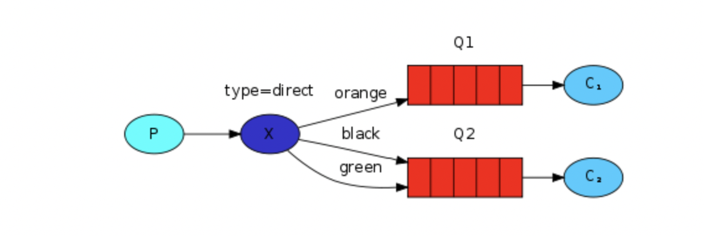

# Routing

##### A binding is a relationship between an exchange and a queue. This can be simply read as: the queue is interested in messages from this exchange.

```
self.channel.queue_bind(exchange=self.exchange_name,
                   queue=self.queue_name)
```

#### Exchange
-------------

Direct exchange: The routing algorithm behind a direct exchange is simple - a message goes to the queues whose binding key exactly matches the routing key of the message.

NOTE: Bindings can take an extra *routing_key* parameter. Don't confuse these with publish *routing_key* parameter



#### Publish
------------

```
channel.basic_publish(
                      exchange='direct_logs',
                      routing_key=severity,
                      body=message
                      )
```

#### Subscribe binding
----------------------

```
channel.queue_bind(exchange='direct_logs',
                    queue=queue_name,
                    routing_key=severity)
```

When you run emitter and receiver: if the routing key: in our case ["info", "warning", "error", "not queued"] matches binding key ["info", "warning", "error"], then it will be logged in file `logs_fron_rabbit.log`

since routing key `not queued` doesn't have matching binding key `not queued`, the log file will not have any entry for `not queued`
