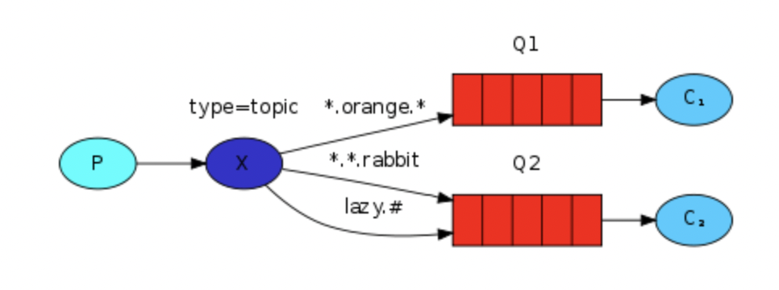

# Topics

##### A message sent with a particular routing key will be delivered to all the queues that are bound with a matching binding key. However there are two important special cases for binding keys:

> 1. (star) can substitute for exactly one word.
> 2. (hash) can substitute for zero or more words.

###### There can be as many words in the routing key as you like, up to the limit of 255 bytes.


#### Example
------------



The messages will be sent with a routing key that consists of three words (two dots). 

1. First word in the routing key will describe a celerity, 
2. second a colour and 
3. third a species: 
```
<celerity>.<colour>.<species>
```

#### Bindings
-------------

Three bindings created:

1. Q1: bound with binding key `*.orange.*` : interested in all the orange animals
2. Q2: bound with `*.*.rabbit` and `lazy.#` : about rabbits, and everything about lazy animals

#### How messages are routed?
-----------------------------

1. message with a routing key set to `quick.orange.rabbit` will be delivered to both queues.
2. message with a routing key set to `lazy.orange.elephant` will be delivered to both queues.
3. message with a routing key set to `quick.orange.fox` will be delivered to first queue.
4. message with a routing key set to `lazy.brown.fox` will be delivered to second queue.
5. message with a routing key set to `lazy.pink.rabbit` will be delivered to second queue only once eventhough it matches two bindings.
6. message with a routing key set to `quick.brown.fox` will be discarded.
7. message with a routing key set to `lazy.orange.male.rabbit` will be delivered to second queue.

###### Note

Topic exchange is powerful and can behave like other exchanges.

1. When a queue is bound with "#" (hash) binding key - it will receive all the messages, regardless of the routing key - like in fanout exchange.

2. When special characters "*" (star) and "#" (hash) aren't used in bindings, the topic exchange will behave just like a direct one.